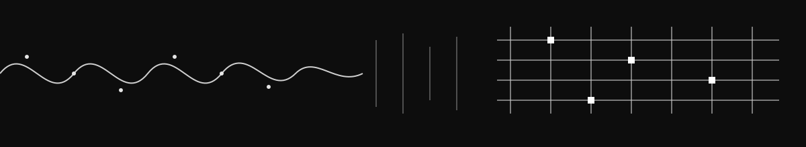

 <h1 align="center">Mohammed Asad</h1> 
<i>I study how systems find structure in signal, biological or artificial.</i>
 
     

## Currently

I started in computer vision, teaching machines to pull identity, diagnosis, and structure out of noisy visual signal. That question never stayed contained to a camera. At **CRCV, UCF**, I work on computational neuroscience and dynamical systems, asking how the brain itself computes. At the **MIAL Lab, SFU**, medical imaging keeps me close to where structure and stakes meet. Recent ECE graduate of **Delhi Technological University**. Next stop, a PhD.

## Focus Areas

  
  
  
   
  
  

## Reach Me

Open to collaborations, PhD conversations, or a hard problem I haven't seen yet.

<i>Systems that fail gracefully instead of confidently.</i>

